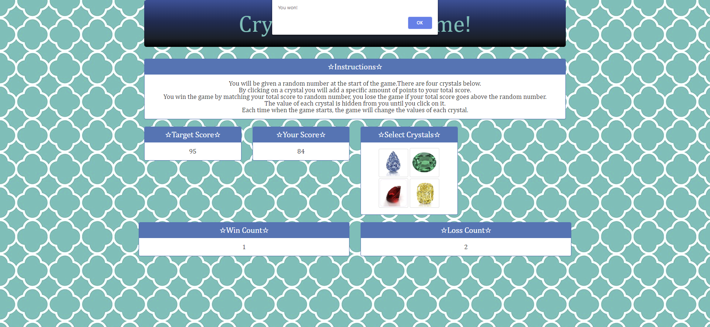

# 💎 Crystal-Collector 💎 
Crystal Collector game using HTML/CSS/BootStrap/JavaScript.

# 📝 Description 📝
Link to the site: https://jcqlng.github.io/Crystal-Collector/

In this application I recreated a game called Crystal Collector. In this game, there will be four crystals displayed as buttons on the page. The player will be shown a random number at the start of the game.

   * When the player clicks on a crystal, it will add a specific amount of points to the player's total score. 

     * The app hides this amount until the player clicks a crystal.
     * When they do click one, the app updates the player's score counter.

   * The player wins if their total score matches the random number from the beginning of the game.

   * The player loses if their score goes above the random number.

   * The game restarts whenever the player wins or loses.

     * When the game begins again, the player should see a new random number. Also, all the crystals will have four new hidden values. Of course, the user's score (and score counter) will reset to zero.

   * The app shows the number of games the player wins and loses. To that end, do not refresh the page as a means to restart the game.


   
# 🕷️ Bug Fixes 🕷️

* July 31, 2020 -- In the first deployment there was a glitch where the target number remained at 0 and in 1 click you won the game.  Overall, in the main process section of the code at the end of the game.js file, what was forgotten at the top was simply the following:
```
startGame();
```` 
* July 31, 2020 -- There was also an issue with the "winning" logic for the app. As you can see below, you will get a message saying you won when in fact you did not. 


Now the game is fully functional and makes sense!!


# 🔗 Links and Resources 🔗
* For some [Javascript](https://codepen.io/karadi/pen/dvoPaP) example 

* [Reset CSS](https://meyerweb.com/eric/tools/css/reset/)

* Final and Complete adjustments were followed by [Homework 4 Video](https://www.youtube.com/watch?v=ki36iUBbCDY&feature=youtu.be) 


# 📷 Images 📷
  * [Red crystal](https://www.google.com/url?sa=i&url=http%3A%2F%2Fwww.crystalcompany.com%2Fdiamond-red.html&psig=AOvVaw3NoQ4SHSZOQ7pXizcTG7gC&ust=1587939527084000&source=images&cd=vfe&ved=0CAIQjRxqFwoTCKCnre3NhOkCFQAAAAAdAAAAABAE)

  * [Blue crystal](https://www.google.com/url?sa=i&url=http%3A%2F%2Fwww.thejewelleryeditor.com%2Fwhats-on%2Fauctions%2Fflawless-vivid-blue-diamond-renamed-the-winston-blue-and-sets-new-world-record%2F&psig=AOvVaw3PCMIFg88jZLzezRdLkmho&ust=1587939768115000&source=images&cd=vfe&ved=0CAIQjRxqFwoTCLj746_PhOkCFQAAAAAdAAAAABAc)

  * [Yellow Crystal](https://www.google.com/url?sa=i&url=https%3A%2F%2Fgeology.com%2Fdiamond%2Fyellow-diamonds%2F&psig=AOvVaw1wqBnqP7IDdtE7mVnM1cQy&ust=1587941228626000&source=images&cd=vfe&ved=0CAIQjRxqFwoTCKjhwJjUhOkCFQAAAAAdAAAAABAH)

  * [Green Crystal](https://www.google.com/url?sa=i&url=https%3A%2F%2Fwww.nwgems.com%2Fproducts%2Fnatural-extra-fine-rich-green-diamond-round-vs2-si1-africa-extra-fine-grade&psig=AOvVaw2pMzbyd1iAbbOOceSKEb0z&ust=1588097594313000&source=images&cd=vfe&ved=2ahUKEwjI3ovZmonpAhVGOK0KHeH7D8cQr4kDegUIARCMAw)

  * [Background Image](https://pixabay.com/illustrations/quatrefoil-pattern-teal-green-898081/)


